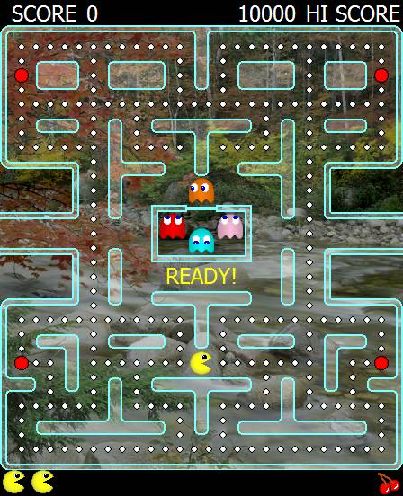



## Enhanced Pacman

### Description

This is a pacman game I wrote which took 3 days to write, about 15 hours all up.

It follows the original pacman game as close as I could and has two modes, original and enhanced, enhanced being just more prettier graphics.

As I didn't use any directX, people with slower computers might find the game runs a little slow, though I'm not sure about this. :)

If your computer is fairly slow and it misses frames then you could change the tmrkeyboard to 20 milliseconds and play it on turbo speed (x2 normal speed). :)
 
### More Info
 

             |
---                |---
**Submitted On**   |2002-03-19 18:25:06
**By**             |[Pookie](https://github.com/Planet-Source-Code/PSCIndex/blob/master/ByAuthor/pookie.md)
**Level**          |Advanced
**User Rating**    |4.8 (300 globes from 62 users)
**Compatibility**  |VB 6\.0
**Category**       |[Games](https://github.com/Planet-Source-Code/PSCIndex/blob/master/ByCategory/games__1-38.md)
**World**          |[Visual Basic](https://github.com/Planet-Source-Code/PSCIndex/blob/master/ByWorld/visual-basic.md)
**Archive File**   |[Enhanced\_P633203192002\.zip](https://github.com/Planet-Source-Code/pookie-enhanced-pacman__1-32821/archive/master.zip)

